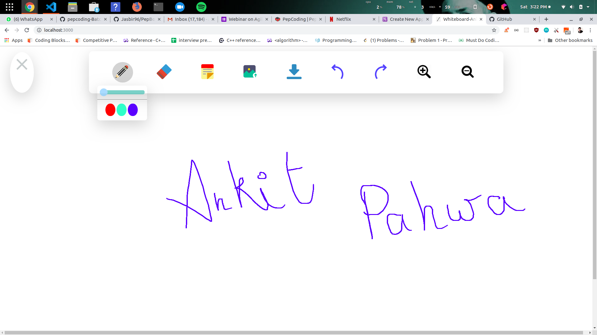

# Realtime Whiteboard

A realtime canvas which has following features :
>
> Draw using multiple shades and strokes
>
> Erase the drwaings
>
> Upload Images
>
> Add sticky notes
> 
> Download the canvas in form of image
>
> Zoom in and Zoom out
>
> Undo and Redo the drawings
>
> Is Realtime , means can be viewed from anywhere live
>

## Installation

Clone the Repo and follow these steps to run on local machine

```bash
git clone
npm install
node express.js
```

## Demo 

This app is deployed at https://realtime-whiteboard-ankit.herokuapp.com/
<br>
